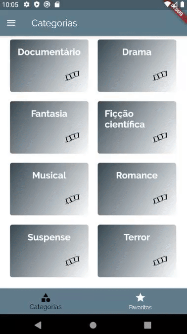

# CINAK FILMES  

Aplicativo de filmes desenvolvido em Flutter com o intuito de mostrar por categorias e filtros de idade os filmes disponíveis, tendo cada filme em seus detalhes, os atores que participam do filme e a descrição. O aplicativo possui múltiplas telas e permite a navegação entre elas como foco principal do desenvolvimento do aplicativo. 
As rotas são configuradas dentro do **MaterialApp** no arquivo main.dart que é compilado ao rodar o emulador. Lembrando que, os filmes inseridos no aplicativo fazem parte de uma "DUMMY_DATA" que dados já prontos para teste.

Movies application developed in Flutter with the aim of showing the available films by categories and age filters, with each film in its details, the actors participating in the film and the description. The application has multiple screens and allows navigation between them as the main focus of the application's development.
The routes are configured inside the **MaterialApp** in the main.dart file that is compiled when running the emulator. Recalling that, the films inserted in the application are part of a "DUMMY_DATA" that data already ready for testing. 

## SCREENSHOTS - CAPTURA DE TELAS

 
    
        
        
    
     
    
        
        
    

Developed by,

Desenvolvido por,

lucascicco.

